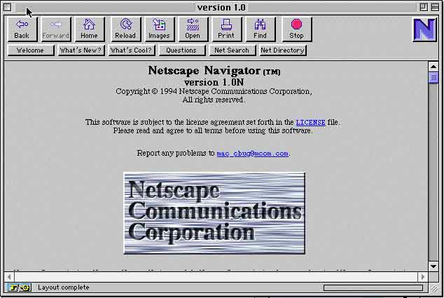
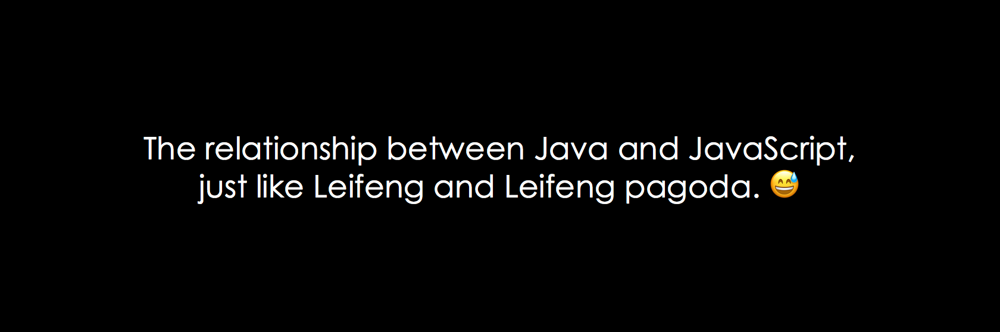
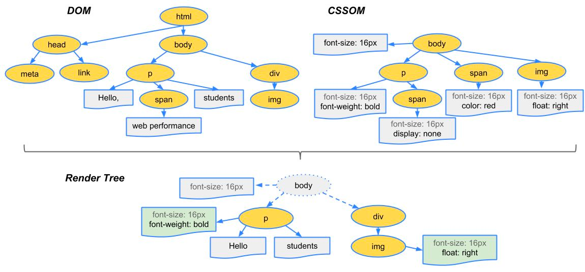
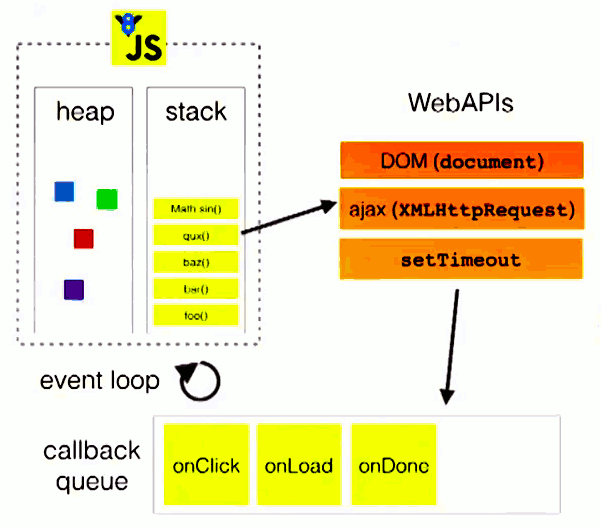

# Session 01 Basics

## 1. The birth of JavaScript

- 1994, The **_Netscape_** is in urgent need of a web scripting language that **_allows browsers to interact with the web_**.
- In 1995, the Sun company renamed the Oak language as **_Java_** and officially launched it to the market.
  Sun has hyped up and promised that this language can be written in a **_Write Once Run Anywhere_**. It looks likely to become the master of the future.
- The situation at the time was that the entire management of the **_Netscape_** was a believer in the **_Java_** language, and **_Sun_** was fully involved in the decision of the web scripting language.

<br>

<p align="center">
    <br>
    <b>Navigator Browser 1.0</b>
</p>

<br>

<p align="center">
    <br>
    <b>Brendan Eich</b>
</p>

In general, the idea of **Brendan Eich**'s design is this:

1. Draw on the basic grammar of the **_C language_**;
2. Learn from the data types and memory management of **_Java language_**;
3. Using the **_Scheme_** language as reference, the function is promoted to the status of "first class citizen";
4. Draw on the **_Self language_** and use the inheritance mechanism based on the prototype (prototype);

<br>

> "The influence of Java to JavaScript is to divide data into two basic types (**primitive**) and object types (**object**), such as **strings** and **string objects**, and introduce **_Y2K Problem_** . It's really unfortunate."

<br>

## 2. JavaScript & Java

<p align="center">
    <br>
    <b>The relationship between JavaScript and Java</b>
</p>

<br>

Their similarities include:

1. Their syntaxs are both similar to **C language**;
2. They are both OOP language (Although in a slightly different way);
3. JavaScript refers to the Java naming rules in the design;


The differences include:

1. JavaScript: **Dynamiclly Typed**、**Weakly Typed**
2. Java: **Statically Typed**、**Strongly Typed**


- **Weakly Typed**:

```javascript
> "1"+2
'12'
```

- **Strongly Typed**:

```python
>>> 1+'1'
Traceback (most recent call last):
  File "<stdin>", line 1, in <module>
TypeError: unsupported operand type(s) for +: 'int' and 'str'
```

- **Statically Typed**:

```java
List<String> name = Arrays.asList("xxx", "yyy", "zzz");
int n = 10;
name.add(n); 
/* Error:(14, 21) java: no suitable method found for add(int)
    method java.util.Collection.add(java.lang.String) is not applicable
      (argument mismatch; int cannot be converted to java.lang.String)
    method java.util.List.add(java.lang.String) is not applicable
      (argument mismatch; int cannot be converted to java.lang.String) */
```

- **Dynamiclly Typed**

```python
>>> a = 1
>>> type(a)
<type 'int'>
>>> a = "s"
>>> type(a)
<type 'str'>
```

```js
> a = 1
1
> typeof a
'number'
> a = '1'
'1'
> typeof a
'string'
```

<br>

## 3. Working principle of browsers

There is a very classic topic in the front-end field called：["**What really happens when you navigate to a URL?**"](http://igoro.com/archive/what-really-happens-when-you-navigate-to-a-url/), of course, DNS lookup and how to build TCP/IP connections are not the focus of this session. the focus of this section is know how the browser render the page after getting the HTML page content:


<p align="center">
    <br>
    <b>The basic flow of the rendering engine.</b>
</p>

<br>

How do HTML and CSS collaborate?

<p align="center">
    <br>
    <b>CSSOM + DOM ===> Render Tree</b>
</p>


## 4. Basic concepts of JavaScript

### 4.1 Syntax

- Case sensitive
- Identifier
- Comments
- Strict mode

### 4.2 Type

- typeof
- Undefined
- Null
- Boolean
- Number
- String
- Object

### 4.3 Function & Scope

### 4.4 Object Type

- Object
- Array
- Date
- RegExp
- Function

### 4.5 How does JavaScript interact with HTML

```js
var app = document.getElementById('app')
app.innerHTML = '<h1>BOLT</h1>'
```

### 4.6 Event Loop Introduction

<p align="center">
    <br>
    <b>Event Loop</b>
</p>


<br>

## 5. Basic concepts of CSS

### 5.1 Basic unit
### 5.2 Selector
### 5.3 Basic style
### 5.4 Text
### 5.5 Display

- inline
- inline-block
- block

### 5.6 Layout

- float
- position

### 5.7 Animation Introduction


## Question

1.

```js
(function() {
   var a = b = 5;
})();
 
console.log(b);
```


